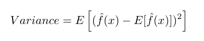
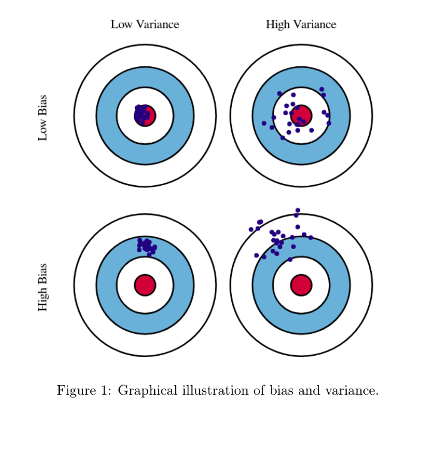
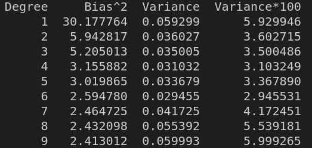
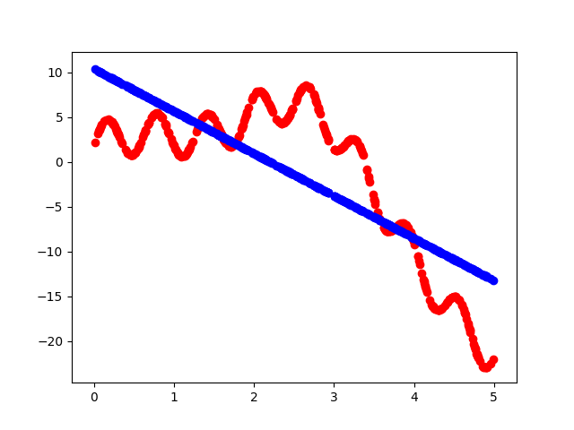
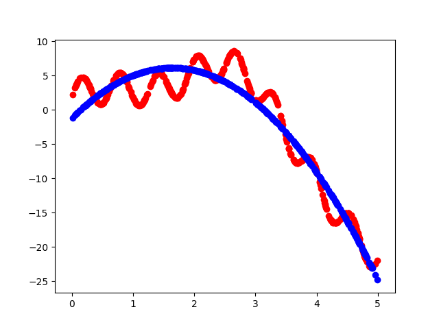
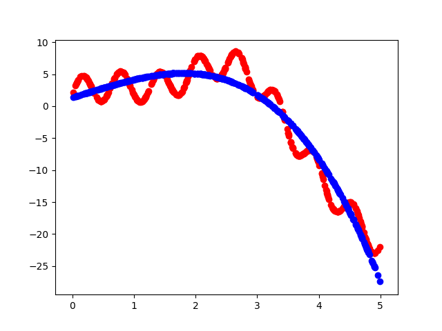
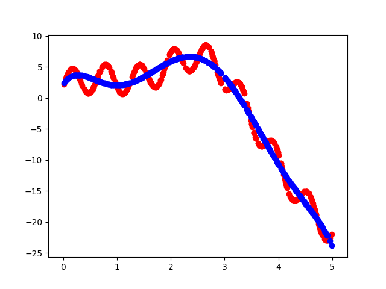
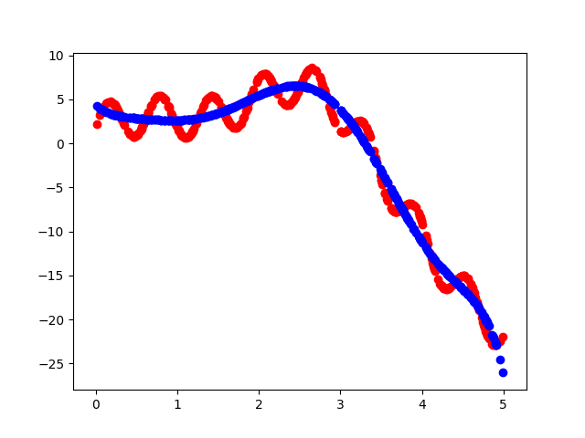
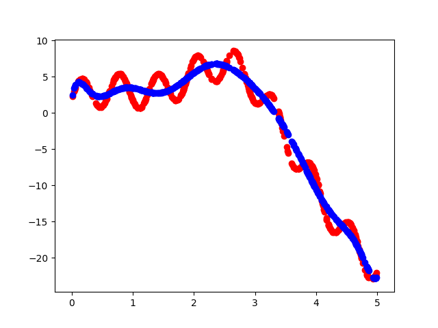
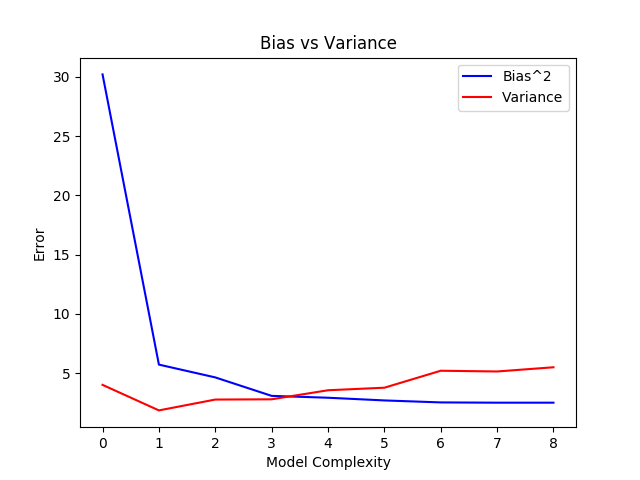

# COMPUTING BIAS AND VARIANCE

The given data set contains a 5000 pairs ( x<sub>i</sub> , y<sub>i</sub>).
The data is loaded using the pickle.load function and then shuffled once.
The main idea is that to calculate the variance we need multiple realisations of the model, so there are multiple ways to resample the given dataset. 
The easiest among them is to randomly divide the train set into multiple subsets, so that we have 10 different realisation of the model.

>## Bias
Bias is the difference between the average prediction of our model and the actual value which we are trying to predict. Models that overgeneralise or extrapolate the information learnt are characterized by a low bias and high variance. 

### Formula


>## Variance
Variance is the variability of the model prediction for a given data point. It is how much the predictions for a given point vary between different realizations of the model. 

### Formula



>## Bull's Eye Graphs for the same 


## Brief Algorithm

The entire data is then split as 90% training data and 10% testing data. Witihin the entire training data set, data is split into 10 data sets.

* The data set partitions are trained for polynomial models with complexity ranging from x to x<sup>9</sup>

* For each of the 10 data set partitions, the model is trained using that data set and the sklearn API : sklearn.linear_model.LinearRegression.fit() using the (x,y) pairs belongning to that partition of the training set.

```py
    poly = PolynomialFeatures(degree=degree, include_bias=False)
    #Transform the polynomial features as required
    X = poly.fit_transform(x_train[i])
    X_TEST = poly.fit_transform(x_test)
    reg = LinearRegression()

    #Train the model for the chosen training set
    reg.fit(X, y_train[i])
    y_predict = reg.predict(X_TEST)
    out[i]=y_predict
```

* Once the model is trained, a matrix with the prediction of the output values for the X_TEST set are obrained for each of the 10 training data set partitions (out[]).

* For Bias : the mean value of the predictions for each data point from all the 10 training data partitions is calculated. Then the Bias formula is used to compute the bias for that particular complexity model

In the code snippet given below, the out matrix is a 10 x 500 matrix containing all the predicted y values for the 10 models. 
point_mean[] is then a 1 x 500 matrix that calculates the mean of the bias for each point. 

Finally bias_mean[degree-1] computes the bias for that particular degree complexity model.

```py
    #calculate bias
    point_mean=np.mean(out,axis=0)
    bias_mean[degree-1]=np.mean((point_mean-y_test)**2)
```

* For variance : Likewise, the variance of the points in all the partitions for that model is computed and then the mean of the variances is calculated for that particular complexity model.
In the code snippet given below, the out matrix is a 20 x 500 matrix containing all the predicted y values for the 20 models. 
Point var is then a 1 x 500 matrix that calculates the var of each point.

Finally var_mean[degree-1] computes the mean of the variance for that particular degree complexity model.

```py
    #calculate variance
    point_var = np.var(out,axis=0)
    var_mean[degree-1]=np.mean(point_var) 
```

* The same procedure is now repeated for models of different complexities (ranging from degree 1 to degree 9). The corresponding values of Bias and Variance for each model are then tabulated. 

## Tabulated Values

### Table1


## Plots obtained for a particular training model

### Degree 1

### Degree 2

### Degree 3

### Degree 4

### Degree 5

### Degree 6

### Degree 7

### Degree 8

### Degree 9



## Bias Variance Tradeoff 

>Here the variance is scaled by a factor of 100 : ie variance = 100 * variance



## Observations
From the above graphs and tabulated values, we observe that with an increase in the complexity of the model the bias decreases and variance increases. 

* That is with increase in the number of features, or complexity/flexibility of the model (essentially increasing the degree of the model to best fit the training data) the model extracts more information from the training sets and works well with them. This is characterised by a low bias with increase in model complexity. 
However at the same time it will not help us generalize data and derive patterns from them. Thus the model may perform poorly on data sets that have not been seen before. This is reflected in the increase in variance with increase in complexity.

* Furthermore for lower degree polynomial models, we observe a high bias but low variance. The reason being, the model may not be able to perform well even on existing training data since the lower degree polynomials are unable to capture all features of the training data. Yet the variance is high, since the model is consistently performing poorly.
