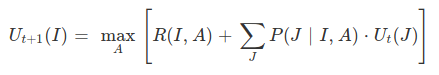
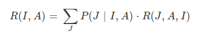
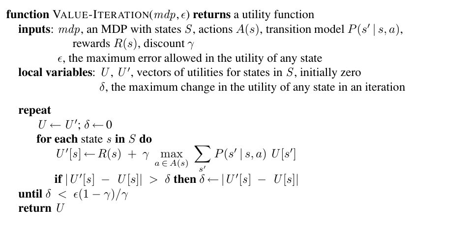

# Value Iteration Algorithm

The Bellman equation is the basis of the value iteration algorithm for solving MDPs.

Let Ut(I) be the utility value for state s at the t'th iteration. The iteration
step, called a Bellman update, looks like this:

Where the Rewards R(I,A) for each state is the expected reward of taking action A in State I. That is :-

The value iteration algorithm is as follows :-

# TASK 1

> Step Costs : [-5,-5,-5]

> Gamma      : 0.99

> Delta      : 0.001

> Iterations : 112

From the task_1_trace.txt file obtained, we can make the following inferences about the policy :

* Whenever Lero has 0 stamina, the only optimal policy for that state is to RECHARGE

* Whenever Lero has 0 arrows, he can RECHARGE or DODGE but cannot SHOOT

* Most of the times, Lero is Risk Averse. That is he prefers to RECHARGE than to SHOOT in cases when his stamina = 50 instead of losing an arrow.

# TASK 2

## PART 1

> Step Costs : [-0.25,-2.5,-2.5]

> Gamma      : 0.99

> Delta      : 0.001

> Iterations : 100

From the task_2_part_1_trace.txt file obtained we can make the following inferences about the changes in the policy :

* Since the step cost for the SHOOT action is less negative compared to the other actions, Lero now becomes Risk Seeking and shoots whenever possible.

* Convergence is faster. In only 100 iterations, the value iteration algorithm converges when compared to the 112 iterations in TASK 1

* Magnitude of the utilities are less negative in this case compared to TASK 1 because of the less negative step cost.

## PART 2

> Step Costs : [-2.5,-2.5,-2.5]

> Gamma      : 0.1

> Delta      : 0.001

> Iterations : 5

From the task_2_part_2_trace.txt file obtained we can make the following inferences about the policy :

* All states converge with a policy in the final iteration with more or less same utilities. 

* The RECHARGE policy is preferred over the others hence indicating a Risk Averse behaviour.

* Bellman update is a contraction by a factor of γ on the space of utility vectors. There is fast convergence if we make γ small, but this effectively gives the agent a short horizon and could miss the long-term effects of the agent’s actions. So we can see that, Lero tries to play it safe and keeps RECHARGING instead of looking into the future.

* Due to a very small discount factor (Gamma), the bellman iterations converge fast, within 4 iterations.

## PART 3 

> Step Costs : [-2.5,-2.5,-2.5]

> Gamma      : 0.1

> Delta      : 0.0000000001

> Iterations : 12

From the task_2_part_3_trace.txt file obtained we can make the following inferences about the policy :

* The only difference between part 2 and part 3 is delta.

* Since the Bellman error is very small we would require more iterations to get a higher accuracy.
Clearly the number of iterations in part 3 are greater than the number of iterations in part 2.

* Lero appears to be risk neutral according to the policy obtained.