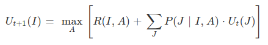
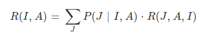
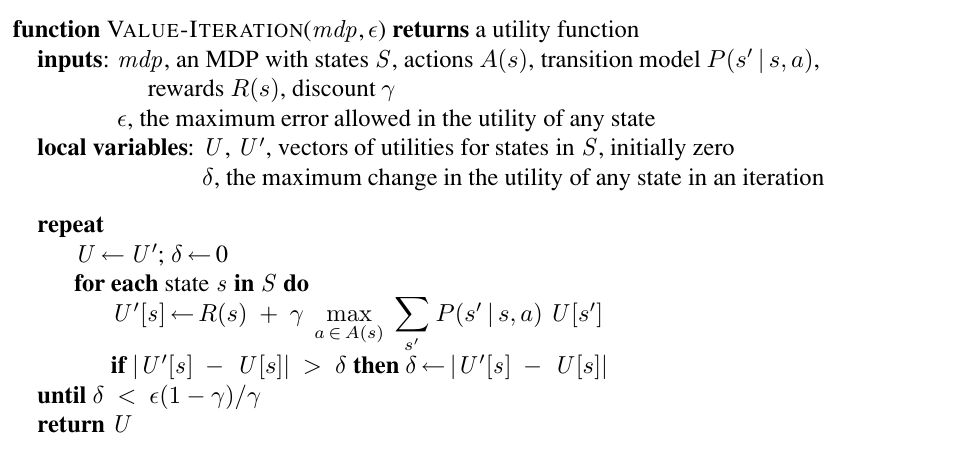

# Value Iteration Algorithm

The Bellman equation is the basis of the value iteration algorithm for solving MDPs.

Let Ut(I) be the utility value for state s at the t'th iteration. The iteration
step, called a Bellman update, looks like this:

Where the Rewards R(I,A) for each state is the expected reward of taking action A in State I. That is :-

The value iteration algorithm is as follows :-

# TASK 1

> Step Costs : [-20,-20,-20]

> Gamma      : 0.99

> Delta      : 0.001

> Iterations : 126

From the task_1_trace.txt file obtained, we can make the following inferences about the policy :

* Whenever Lero has 0 stamina, the only optimal policy for that state is to RECHARGE

* Whenever Lero has 0 arrows, he can RECHARGE or DODGE but cannot SHOOT

* Most of the times, Lero is Risk Averse. That is he prefers to RECHARGE than to SHOOT in cases when his stamina = 50 instead of losing an arrow.

*

# TASK 2

## PART 1

> Step Costs : [-0.25,-2.5,-2.5]

> Gamma      : 0.99

> Delta      : 0.001

> Iterations : 99

From the task_2_part_1_trace.txt file obtained we can make the following inferences about the policy :

* Since the step cose for the SHOOT action is less negative compared to the other actions, Lero now becomes Risk Seeking in situations where the Mighty Dragon's health is beatable.

* The SHOOT action is taken more number of times as compared to the case when all the 3 actions had the same PENALTY

* Convergence is faster. In only 99 iterations, the value iteration algorithm converges when compared to the 126 iterations in TASK 1

## PART 2

> Step Costs : [-2.5,-2.5,-2.5]

> Gamma      : 0.1

> Delta      : 0.001

> Iterations : 4

From the task_2_part_2_trace.txt file obtained we can make the following inferences about the policy :

* All states converge with a policy in the final iteration with more or less same utilities.

* The RECHARGE policy is preferred over the others hence indicating a Risk Averse behaviour.

* Due to a very small discount factor (Gamma), the bellman iterations converge fast, within 4 iterations.

## PART 3 

> Step Costs : [-2.5,-2.5,-2.5]

> Gamma      : 0.99

> Delta      : 0.0000000001

> Iterations : 235

From the task_2_part_2_trace.txt file obtained we can make the following inferences about the policy :

* All states converge with a policy in the final iteration with more or less same utilities.

* The RECHARGE policy is preferred over the others hence indicating a Risk Averse behaviour.

* Due to a very small discount factor (Gamma), the bellman iterations converge fast, within 4 iterations.