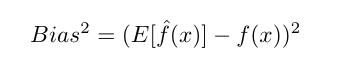
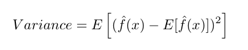
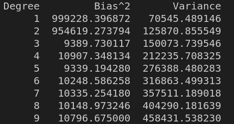
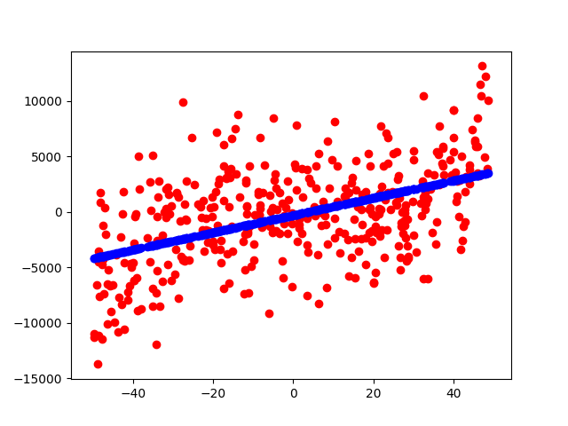
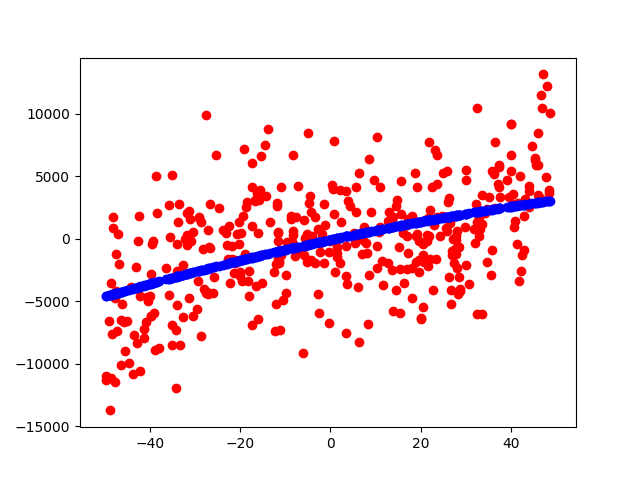
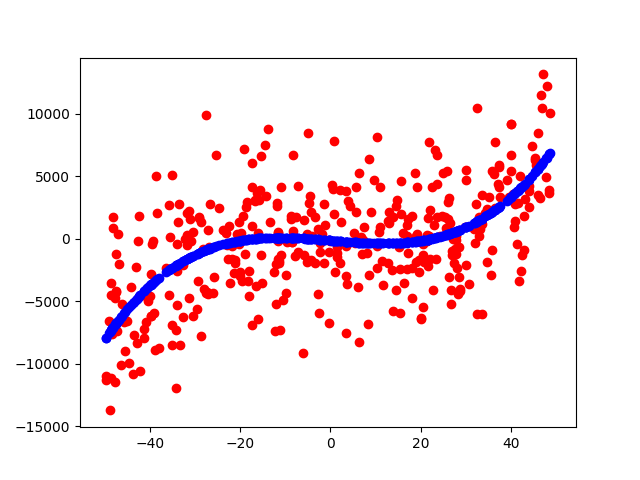
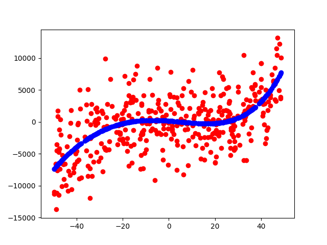
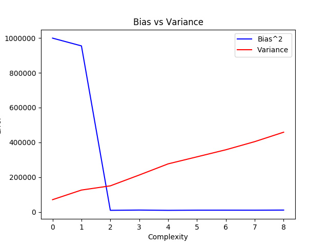

# COMPUTING BIAS AND VARIANCE

The given data set contains a 20 subsets of training data containing 400 samples each.
The data is loaded using the pickle.load function.
For each polynomial complexity, 20 models are trained on 20 different subsets. From this we obtain the bias and the variance of the predictions on the testing data

>## Bias
Bias is the difference between the average prediction of our model and the actual value which we are trying to predict. Models that overgeneralise or extrapolate the information learnt are characterized by a low bias and high variance.

### Formula


>## Variance
Variance is the variability of the model prediction for a given data point. It is how much the predictions for a given point vary between different realizations of the model. 

### Formula


## Brief Algorithm

All the 4 data files are loaded using pickle.load() :  namely Fox_test, x_test, y_train, x_train

* The data set partitions are trained for polynomial models with complexity ranging from x to x<sup>9</sup>

* For each of the 20 data set partitions, the model is trained using that data set and the sklearn API : sklearn.linear_model.LinearRegression.fit() using the (x,y) pairs belongning to that partition of the training set.

```py
    poly = PolynomialFeatures(degree=degree, include_bias=False)
    #Transform the pilynomial features as required
    X = poly.fit_transform(x_train[i])
    X_TEST = poly.fit_transform(x_test)
    reg = LinearRegression()

    #Train the model for the chosen training set
    reg.fit(X, y_train[i])
    y_predict = reg.predict(X_TEST)
```

* Once the model is trained, a matrix with the prediction of the output values for the X_TEST set are obrained for each of the 20 training data set partitions.

* For Bias : the mean value of the predictions for each data point from all the 10 training data partitions is calculated. Then the Bias formula is used to compute the bias for that particular complexity model ... insert formula

* For variance : Likewise, the variance of the points in all the partitions for that model is computed and then the mean of the variances is calculated for that particular complexity model.

* Once all the 10 subsets of the training set are trained and examined for that particular complexity model, then 

* The same procedure is now repeated for models of different complexities (ranging from degree 1 to degree 9). The corresponding values of Bias and Variance for each model are then tabulated. 

## Tabulated Values

### Table 


## Plots obtained for a particular training model

### Degree 1

### Degree 2

### Degree 3

### Degree 4

### Degree 5

### Degree 6

### Degree 7

### Degree 8

### Degree 9


## Bias-Variance Trade-Off Plot obtained

### bvplot



## Observations
From the above graphs and tabulated values, we observe that with an increase in the complexity of the model the bias increases and variance decreases. 

* Overfitting : 
The phenomenon of memorization can cause overfitting.  
That is with increase in the number of features, or complexity/flexibility of the model (essentially increasing the degree of the model to best fit the training data) the model extracts more information from the training sets and works well with them. However at the same time it will not help us generalize data and derive patterns from them. Thus the model may perform poorly on data sets that have not been seen before. This is reflected in the increase in variance with increase in complexity. Thus the model is said to be overfitting.
Higher degree polynomials can usually be overfitting.
Overfitting occurs when we try to describe the learning rules based on a relatively small number of observations.

* Underfitting: 
When a model is underfit, it does not perform well on the training sets and does not perform well on the test sets either. That is it fails to capture the underlying trend of the date. Furthermore for lower degree polynomial models, we observe a high bias but low variance. The reason being, the model may not be able to perform well even on existing training data since the lower degree polynomials are unable to capture all features of the training data. Yet the variance is high, since the model is consistently performing poorly. Therefore lower degree polynomials can usually be underfitting. 
